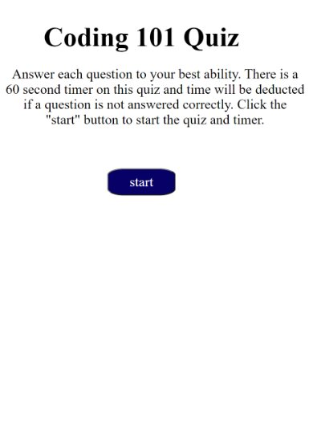

# Code Quiz
This is a quiz focused on JavaScript for beginner web developers. It is timed and the time gets deducted if questions are answered incorrectly. The page then calculates the users score on the quiz and displays it for them at the end.

## Usage
Beginner JavaScript developers can use this quiz as a study tool.

## Link

https://howardk97.github.io/Code-Quiz/